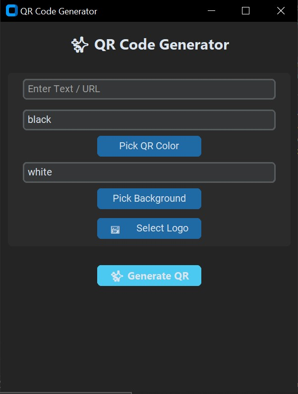

# ✨ QR Code Generator

This is a simple yet powerful QR Code Generator application built with `customtkinter` and `qrcode` libraries. It allows you to generate customizable QR codes with various options, including data encoding, foreground and background colors (even transparent backgrounds\!), and the ability to embed a logo.

## Features

  * **Generate QR Codes from Text or URLs:** Quickly convert any text or URL into a scannable QR code.
  * **Customizable Colors:** Choose distinct colors for your QR code's foreground and background.
  * **Transparent Backgrounds:** Option to create QR codes with a transparent background, perfect for overlaying on images.
  * **Embed Logos:** Personalize your QR codes by embedding a logo directly into the center.
  * **Intuitive User Interface:** A clean and user-friendly interface powered by `customtkinter`.
  * **Real-time Preview:** See a preview of your generated QR code before saving.
  * **Save as PNG:** Export your QR codes as high-quality PNG images.

## Screenshots



## Installation

To run this application, you'll need Python installed on your system. Follow these steps:

1.  **Clone the repository (or download the script):**

    ```bash
    git clone https://github.com/MohammedRaghib/QR-Code-Generator.git
    cd qr-code-generator
    ```

    *(If you don't have a repository, you can simply tell the user to save the provided code as a `.py` file, e.g., `qr_generator.py`)*

2.  **Install the required libraries:**

    Open your terminal or command prompt and run the following command:

    ```bash
    pip install customtkinter qrcode Pillow
    ```

      * `customtkinter`: For the modern GUI.
      * `qrcode`: For generating the QR code data.
      * `Pillow` (PIL): For image processing, including adding logos and handling transparency.

## How to Use

1.  **Run the application:**

    ```bash
    python your_script_name.py
    ```

    *(Replace `your_script_name.py` with the actual name of your Python file, e.g., `qr_generator.py`)*

2.  **Enter Data:** In the "Enter Text / URL" field, type the text or paste the URL you want to encode into the QR code.

3.  **Choose QR Color:**

      * Enter a hexadecimal color code (e.g., `#000000` for black) directly into the "QR Color" field.
      * Alternatively, click the "Pick QR Color" button to open a color picker and select your desired color.

4.  **Choose Background Color:**

      * Enter a hexadecimal color code (e.g., `#FFFFFF` for white) into the "Background Color" field.
      * Type `transparent` if you want the QR code's background to be transparent.
      * Click the "Pick Background" button to use the color picker.

5.  **Select Logo (Optional):** Click the "🖼️ Select Logo" button to browse and select an image file (PNG, JPG, JPEG) to embed as a logo in the center of your QR code.

6.  **Generate and Save:** Click the "✨ Generate QR" button.

      * A preview of your QR code will appear at the bottom.
      * A "Save As" dialog will pop up, allowing you to choose where to save your generated QR code as a PNG image.

## Contributing

Feel free to fork this repository, make improvements, and submit pull requests. Any contributions are welcome\!

## License

This project is open source and available under the [MIT License](https://www.google.com/search?q=LICENSE).

-----